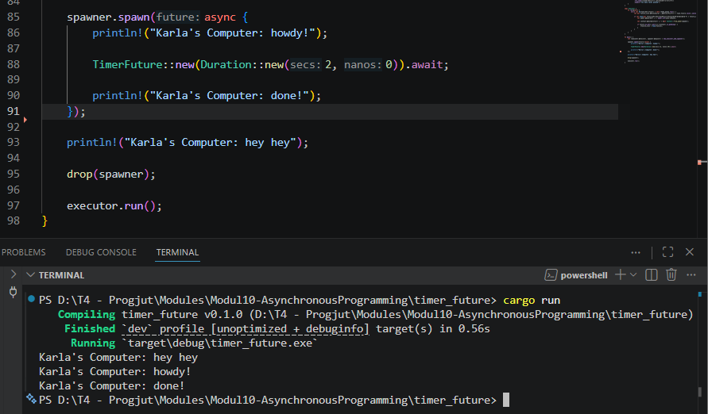
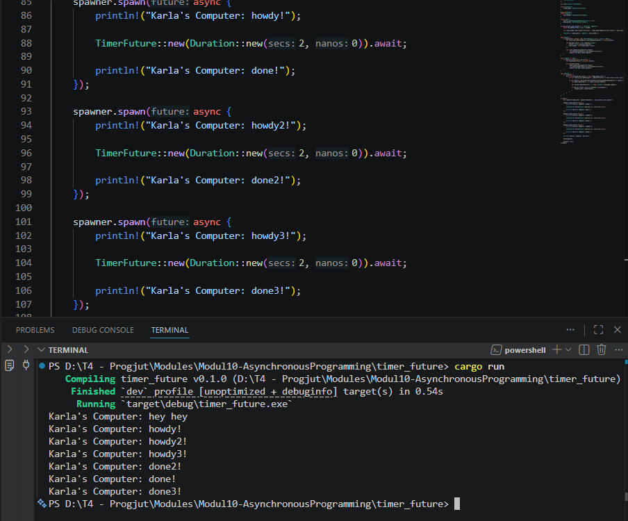
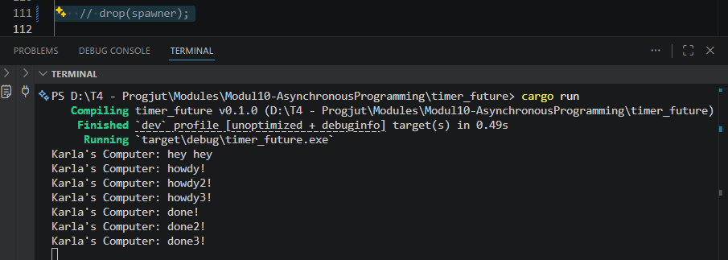

# Module 10 - Asynchronous Programming

## Experiment 1.1: Original timer from the book

The program follows the implementation from the Async Book executor tutorial. The asynchronous task prints a message before waiting asynchronously for two seconds using `TimerFuture`, then prints another message after the timer completes.

---

## Experiment 1.2: Understanding how it works

After adding another `println!` statement directly after `spawner.spawn(...)`, the output shows that the newly added print statement executes immediately without waiting for the asynchronous timer to finish.

This happens because `spawn()` only schedules the future into the executor queue. The main thread continues executing the next instruction while the executor runs the spawned asynchronous task separately.

### Output

---

## Experiment 1.3: Multiple Spawn and removing drop

### Multiple Spawn

After creating multiple spawned tasks, all tasks are scheduled concurrently by the executor. Each task prints its first message immediately, waits asynchronously for two seconds, and then resumes execution.

The order of completion messages may vary because asynchronous tasks are executed independently by the executor.

### Output

### Removing `drop(spawner)`

When `drop(spawner);` is removed, the executor continues waiting for incoming tasks indefinitely. The task channel remains open because the spawner still exists, so the executor assumes additional tasks may still arrive.

As a result, the program does not terminate automatically even after all spawned tasks finish execution.

### Output
